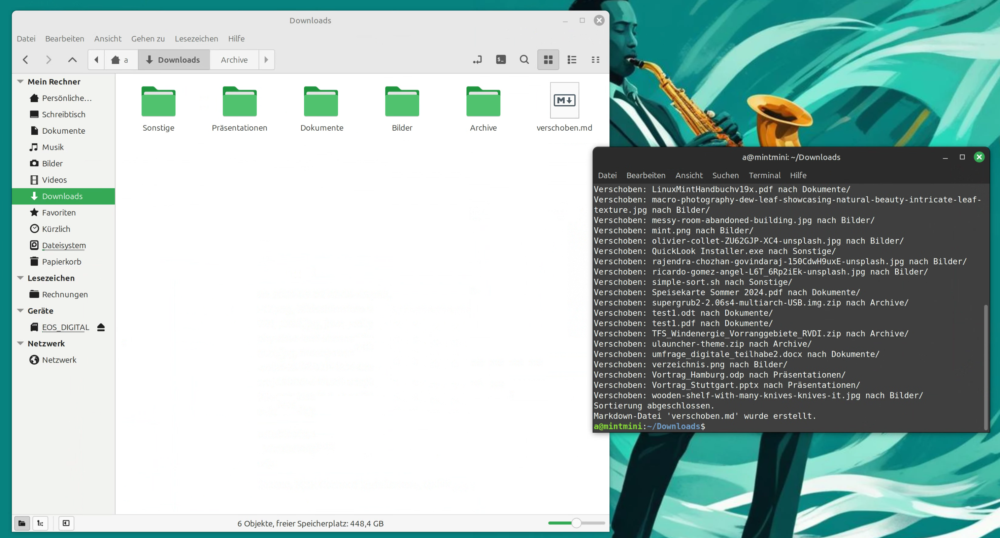

# simple-sort

Bash script that quickly groups files by media type and moves them to separate folders.

Sorting is lightning fast: Simply start the script in a directory - all files there are immediately moved to subfolders. 

In addition, a Markdown file is created in the output folder, which lists in a table which documents have been moved to which folder.
The script can be revised and supplemented very easily - simply call it up in the text editor and design the preamble according to your own wishes.

## Example: cluttered download folder

## Cleaned up directory

## Markdown document with clear table

